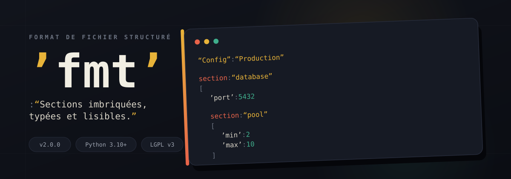

<div align="center">
  
</div>

<div align="center">

[](#)
[](#)
[](LICENSE)

</div>

<br>

**`fmt`** est un format de fichier texte structuré — lisible par l'humain, typé nativement, et capable d'imbriquer des sections dans des sections. Ce module Python permet de le lire, l'écrire et le manipuler avec une API claire et entièrement documentée.

```
section : "database"
[
'host' : "localhost"
'port' : 5432

  section : "pool"
  [
  'min' : 2
  'max' : 10
  ]
]
```

Quoté = chaîne de caractères. Non quoté = type inféré (`int`, `float`, `bool`, `null`). Aucune ambiguïté, aucune surprise.

<br>

## Pourquoi `.fmt` ?

| | |
|---|---|
| **Lisible** | Une syntaxe pensée pour être lue et écrite à la main, sans accolades ni indentation fragile |
| **Typé** | `42` ≠ `"42"` — le type est explicite dans le fichier, pas deviné au hasard |
| **Imbriqué** | Sections dans des sections, jusqu'à 10 niveaux de profondeur configurables |
| **Robuste** | Erreurs de syntaxe avec numéro de ligne réel, mode strict, validation par schéma |
| **Libre** | Utilisable dans n'importe quel projet, même fermé — voir [Licence](#licence) |

<br>

## Installation

```bash
pip install git+https://github.com/bono-p/format_v2.git@main
```

<br>

## Exemple rapide

```python
import fmt

# Créer un document
doc = fmt.new("Config", "Serveur de production")

db = doc.add_section("database")
db.set("host", "localhost").set("port", 5432)

pool = db.add_section("pool")
pool.set("min", 2).set("max", 10)

doc.save("config.fmt")

# Relire, naviguer, typer
doc = fmt.load("config.fmt")
doc.get("database/pool", "max")        # → 10  (int)
doc.section("database").get_int("port")  # → 5432
```

<br>

## Documentation complète

La spécification du format, la grammaire EBNF, la référence API exhaustive et le guide de migration sont disponibles dans **[DOCUMENTATION.md](DOCUMENTATION.md)**.

<br>

## Licence

Distribué sous licence **LGPL v3**.

```
✅  Utilisable librement, y compris dans des projets commerciaux fermés
✅  Modifiable et intégrable sans obligation de partager VOTRE code
⚠️  Si vous modifiez le module fmt lui-même, ces modifications doivent
    rester publiques et disponibles à la communauté
```

Voir [LICENSE](LICENSE) pour le texte complet.

<br>

## Remerciements

Ce module a été conçu et développé avec l'aide de Claude (Anthropic) pour l'architecture, l'audit et l'implémentation v2.

<br>

<div align="center">
<sub>Conçu par <a href="https://github.com/bono-p">bono-p</a></sub>
</div>
